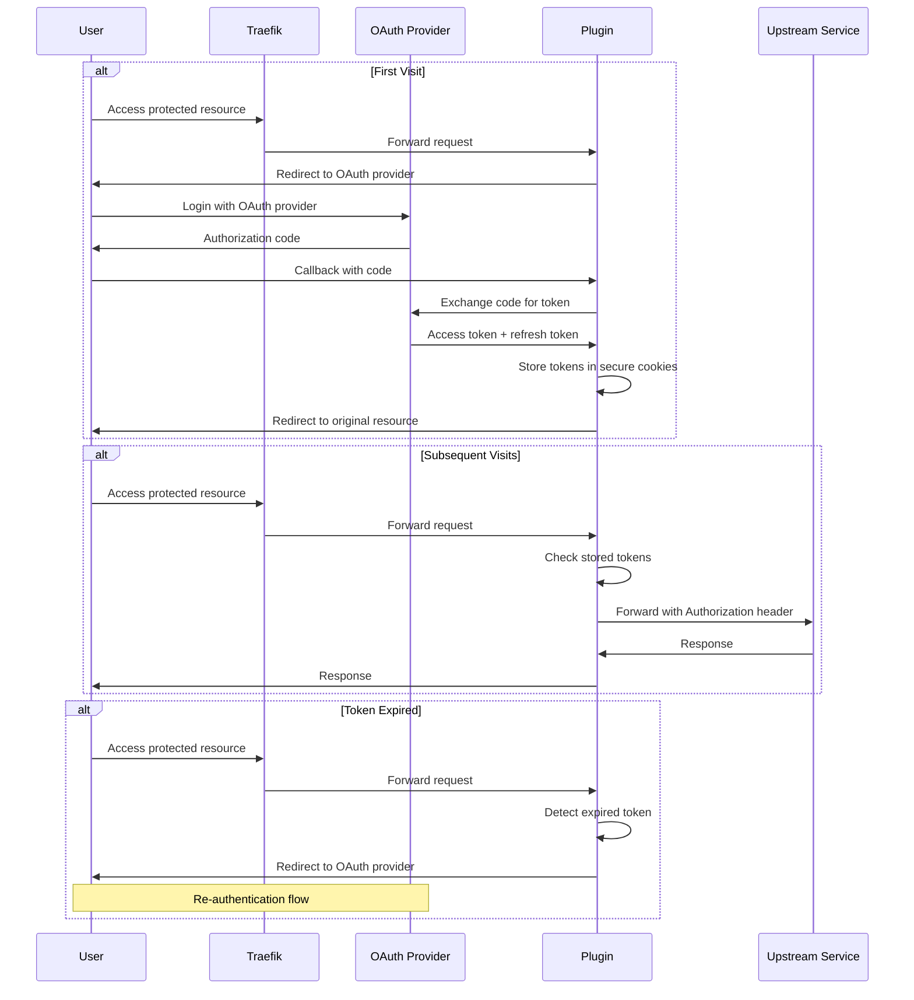

# Traefik OAuth Upstream Plugin

A Traefik middleware plugin that handles OAuth authentication for upstream services. This plugin automatically manages OAuth tokens and adds them to requests sent to your backend services, while providing flexible email-based access control.

## Features

- 🔐 **OAuth 2.0 Integration**: Supports any OAuth 2.0 provider (Google, GitHub, etc.)
- 🍪 **Automatic Token Management**: Handles token storage, refresh, and expiration
- 📧 **Email-based Access Control**: Restrict access by specific emails or email domains
- 🔄 **Seamless User Experience**: Automatic redirects and token refresh
- 🛡️ **Secure Cookie Storage**: Tokens stored in HTTP-only, secure cookies
- ⚙️ **Flexible Configuration**: Easy setup with Traefik dynamic configuration

## How It Works

This middleware acts as an OAuth proxy between your users and your backend services:

1. **First Visit**: User is redirected to OAuth provider for authentication
2. **Authentication**: User logs in with OAuth provider (e.g., Google)
3. **Token Exchange**: Plugin exchanges authorization code for access token
4. **Access Control**: Plugin validates user's email against allowed lists
5. **Request Forwarding**: Authenticated requests are forwarded to upstream with OAuth headers

## Typical Flow



## Configuration

### Basic Configuration

```yaml
# traefik.yml
http:
  middlewares:
    oauth-upstream:
      plugin:
        traefik-oauth-upstream:
          clientId: "your-oauth-client-id"
          clientSecret: "your-oauth-client-secret"
          authUrl: "https://accounts.google.com/o/oauth2/auth"
          tokenUrl: "https://oauth2.googleapis.com/token"
          scopes: ["openid", "email", "profile"]
```

### Advanced Configuration

```yaml
http:
  middlewares:
    oauth-upstream:
      plugin:
        traefik-oauth-upstream:
          # OAuth Provider Configuration
          clientId: "your-oauth-client-id"
          clientSecret: "your-oauth-client-secret"
          authUrl: "https://accounts.google.com/o/oauth2/auth"
          tokenUrl: "https://oauth2.googleapis.com/token"
          scopes: ["openid", "email", "profile"]
          
          # Access Control (Optional)
          allowedEmails: 
            - "admin@example.com"
            - "user@example.com"
          allowedEmailDomains:
            - "company.com"
            - "partner.org"
```

### Configuration Parameters

| Parameter | Type | Required | Description |
|-----------|------|----------|-------------|
| `clientId` | string | ✅ | OAuth client ID from your provider |
| `clientSecret` | string | ✅ | OAuth client secret from your provider |
| `authUrl` | string | ✅ | OAuth authorization URL |
| `tokenUrl` | string | ✅ | OAuth token exchange URL |
| `scopes` | array | ✅ | OAuth scopes to request |
| `allowedEmails` | array | ❌ | Specific emails allowed to access |
| `allowedEmailDomains` | array | ❌ | Email domains allowed to access |

### Access Control

- **No restrictions**: If neither `allowedEmails` nor `allowedEmailDomains` is configured, all authenticated users are allowed
- **Email whitelist**: Use `allowedEmails` to specify exact email addresses
- **Domain whitelist**: Use `allowedEmailDomains` to allow all emails from specific domains
- **Combined**: You can use both `allowedEmails` and `allowedEmailDomains` together

## OAuth Provider Examples

### Google OAuth

```yaml
http:
  middlewares:
    google-oauth:
      plugin:
        traefik-oauth-upstream:
          clientId: "your-google-client-id"
          clientSecret: "your-google-client-secret"
          authUrl: "https://accounts.google.com/o/oauth2/auth"
          tokenUrl: "https://oauth2.googleapis.com/token"
          scopes: ["openid", "email", "profile"]
```

### GitHub OAuth

```yaml
http:
  middlewares:
    github-oauth:
      plugin:
        traefik-oauth-upstream:
          clientId: "your-github-client-id"
          clientSecret: "your-github-client-secret"
          authUrl: "https://github.com/login/oauth/authorize"
          tokenUrl: "https://github.com/login/oauth/access_token"
          scopes: ["user:email"]
```

## Usage with Traefik

### Docker Compose Example

```yaml
version: '3.8'

services:
  traefik:
    image: traefik:v3.0
    command:
      - --api.dashboard=true
      - --providers.docker=true
      - --providers.file.directory=/etc/traefik/dynamic
      - --entrypoints.web.address=:80
      - --entrypoints.websecure.address=:443
    ports:
      - "80:80"
      - "443:443"
      - "8080:8080"
    volumes:
      - /var/run/docker.sock:/var/run/docker.sock:ro
      - ./dynamic:/etc/traefik/dynamic
    labels:
      - "traefik.enable=true"
      - "traefik.http.routers.traefik.rule=Host(`traefik.localhost`)"
      - "traefik.http.routers.traefik.entrypoints=web"

  your-app:
    image: your-app:latest
    labels:
      - "traefik.enable=true"
      - "traefik.http.routers.app.rule=Host(`app.localhost`)"
      - "traefik.http.routers.app.entrypoints=web"
      - "traefik.http.routers.app.middlewares=oauth-upstream"
      - "traefik.http.services.app.loadbalancer.server.port=8080"
```

### Dynamic Configuration

```yaml
# dynamic/oauth.yml
http:
  middlewares:
    oauth-upstream:
      plugin:
        traefik-oauth-upstream:
          clientId: "your-client-id"
          clientSecret: "your-client-secret"
          authUrl: "https://accounts.google.com/o/oauth2/auth"
          tokenUrl: "https://oauth2.googleapis.com/token"
          scopes: ["openid", "email", "profile"]
          allowedEmailDomains: ["yourcompany.com"]

  routers:
    protected-app:
      rule: "Host(`app.example.com`)"
      middlewares: ["oauth-upstream"]
      service: "protected-service"
```

## Security Features

- **Secure Cookies**: Tokens are stored in HTTP-only, secure cookies
- **Token Refresh**: Automatic token refresh when possible
- **Email Validation**: Optional email-based access control
- **HTTPS Required**: Secure flag ensures cookies only work over HTTPS
- **Path Restriction**: Cookies are restricted to the application path

## Headers Added to Upstream

The plugin adds the following headers to requests sent to your upstream service:

- `Authorization: Bearer <access_token>` - OAuth access token
- `X-User-Email: <user_email>` - User's email address (when email validation is enabled)

## Development

### Building the Plugin

```bash
# Build the plugin
make build

# Run tests
make test

# Clean build artifacts
make clean
```

### Prerequisites

- Go 1.19+
- Traefik v3.0+

## License

This project is licensed under the MIT License - see the [LICENSE](LICENSE) file for details.

## Contributing

1. Fork the repository
2. Create a feature branch
3. Make your changes
4. Add tests if applicable
5. Submit a pull request

## Support

For issues and questions, please open an issue on the GitHub repository.